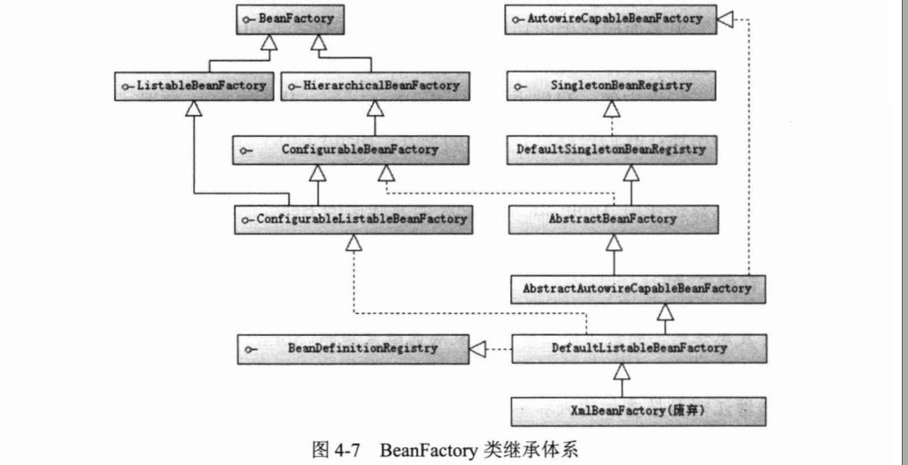
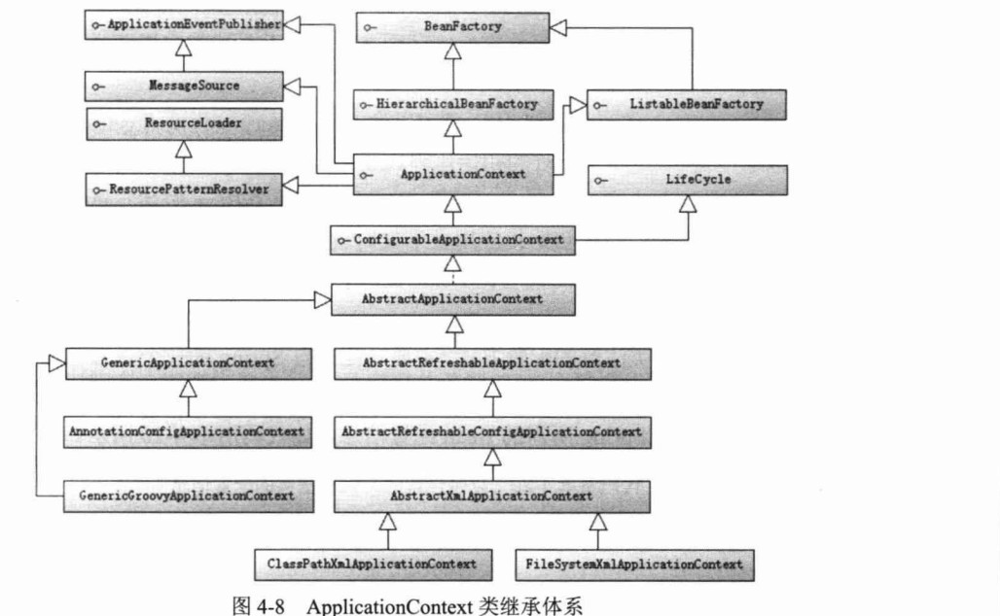
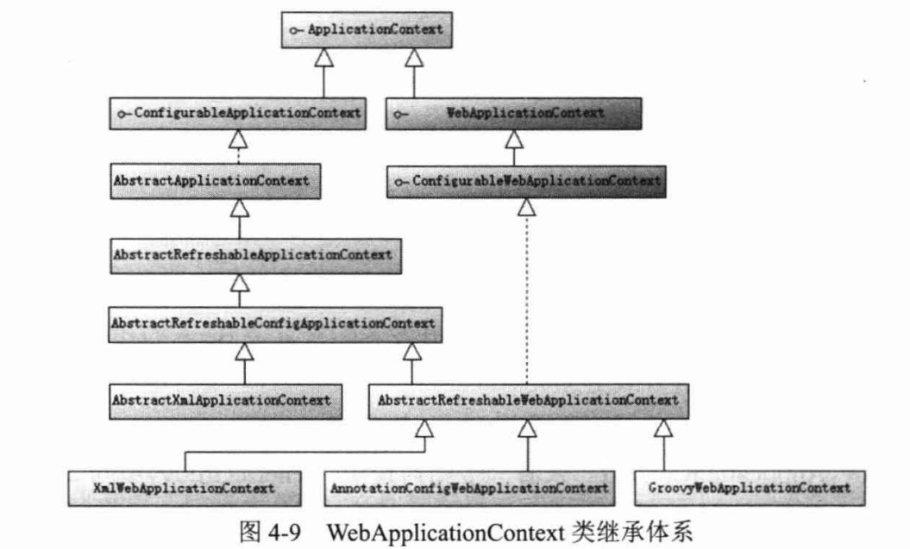
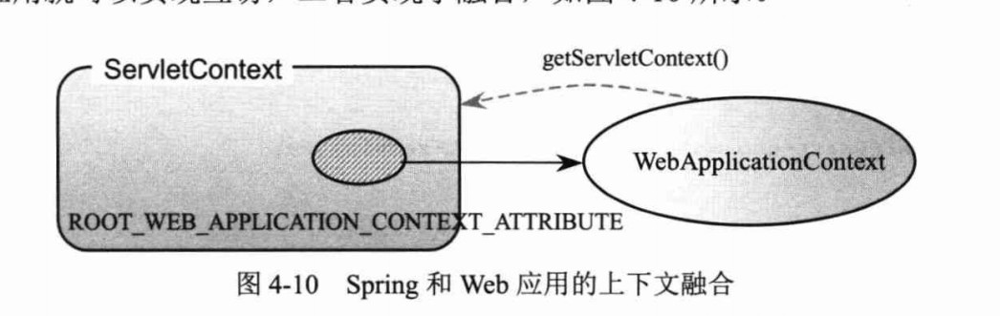
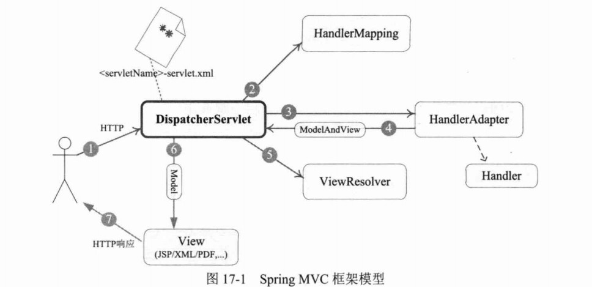

## 1.动态代理

- 动态代理是jdk自带的
- 动态代理是通过import java.lang.reflect.Proxy 对象的newProxyInstance() 方法,newProxyInstance() 方法需要传入三个参数
  - 被代理类的**ClassLoader**
  - **被代理类的接口Class对象**
  - InvocationHandler() 的实现

- 实现InvocationHandler() 接口中的invoke() 方法 ,method方法可获取需要代理的方法

## 2.静态代理

静态代理需要被代理类的接口,通过实现同一接口,调用被代理类方法,在实现方法中添加代码实现增强

## 3.cglib代理

cglib代理是通过继承被代理对象实现类的方式

**Enhancer** 对象的setSuperclass() 设置被被代理对象的Class对象

setCallback() 此方法传入一个MethodInterceptor() 接口,实现接口中的intercept() 方法,通过method的invoke()	调用实现增强


**接口是一种契约，实现类型必须满足它，它描述了类型的行为，规定类型可以做什么。 接口彻底将类型能做什么，以及如何做分离开来，使得相同接口的变量在不同的时刻表现出不同的行为，这就是多态的本质。** 

## 4.代理总结

- **创建速度**cglib代理创建对象的速度,比jdk动态代理创建对象的速度慢大概 8 倍
- **代理对象性能**cglib代理创建代理对象的性能,比jdk动态代理创建出来的对象的性能高出10倍
- **spring应用**对于singleton代理对象或者具有实例池的代理,无需频繁创建对象,使用的是cglib代理,反之采用jdk代理


## 5.springAOP

### 5.1MethodBeforeAdvice

- **创建增强**实现MethodBeforeAdvice接口中的before()方法,书写增强代码
- 设置ProxyFactory,
  - setInterfaces()方法,设置被被代理对象实现类的接口,如果设置接口使用动态代理,如果没有设置接口使用cglib代理
  - setTarget() 设置被代理对象
  - getProxy() 获取被代理对象

### 5.2AfterReturningAdvice

同上

### 5.3MethodInterceptor(环绕增强)

同上

### 5.4ThrowsAdvice(异常抛出增强)

同上

### 5.5引介增强

引介增强是一种比较特殊的增强，他不是在目标方法周围植入增强，而是为目标类创建新的方法，属性，所以引介增强的连接点是类级别的，而非方法级别的，通过引介增强可以为目标类添加一个接口的实现，即原来目标类为实现某个接口，通过引介增强可以为目标类创建实现某接口的代理，因此能在横向定义接口的实现方法，思考问题的角度发生了很大的变化

​	IIntroductioninterceptor 引介增强接口

​	DelegatingIntroductioninterceptor 通过拓展实现类定义自己的引介增强类

## 6.IOC


**控制反转?**

把复杂系统分解成相互合作的对象，这些对象类通过封装以后，内部实现对外部是透明的，从而降低了解决问题的复杂度，而且可以灵活地被重用和扩展

**ioc解耦图**


依赖注入(DI)和控制反转(IOC)是从不同的角度的描述的同一件事情，就是指**通过引入IOC容器，利用依赖关系注入的方式，实现对象之间的解耦**

### 6.1ioc技术剖析

- IOC最基础的技术就是反射(**根据给出的类名（字符串方式）来动态地生成对象**)
- **我们可以把IOC容器的工作模式看做是工厂模式的升华，可以把IOC容器看作是一个工厂，这个工厂里要生产的对象都在配置文件中给出定义，然后利用编程语言的的反射编程，根据配置文件中给出的类名生成相应的对象。从实现来看，IOC是把以前在工厂方法里写死的对象生成代码，改变为由配置文件来定义，也就是把工厂和对象生成这两者独立分隔开来，目的就是提高灵活性和可维护性**

### 6.2BeanFactory与ApplicationContext

- ApplicationContext 是建立在BeanFactroy之上,提供更多面向应用功能
- 我们称BeanFactory为Ioc容器,ApplicationContext为上下文
- **区别**
  - BeanFactory是springframework的**基础设施**面向spring本身
  - ApplicationContext面向开发者,
  - 几乎所有的场景都是用Applicationcontext而非BeanFactory

#### 6.2.1BeanFactory



- ListableBeanFactory   接口表示这些 Bean 是可列表的
- HierarchicalBeanFactory 表示的是这些 Bean 是有继承关系的
- AutowireCapableBeanFactory 接口定义 Bean 的自动装配规则
- DefaultListableBeanFactory 继承上三种接口
- **这四个接口共同定义了 Bean 的集合、Bean 之间的关系、以及 Bean 行为、最基本的IOC容器接口BeanFactory**

#### 6.2.2ApplicationContext



- **ApplicationContext和BeanFactory初始化区别**
  - BeanFactory初始化容器时,并没有实例化bean,直到第一次访问某个bean的时候才会初始化
  - ApplicationContext在初始化应用上下文时就实例化所有**单利**的bean,
  - ApplicationContext比BeanFactory初始化时间长

- ApplicationContext提供了ClassXmlPathApplicationContext和FileSystemXmlApplicationContext两个实现类,用于加载根目录下,和系统目录下
- ConfigurableApplicationContext拓展ApplicationContext,新增**refresh() close() 方法**
  - refresh(),在上下文关闭的情况下,可以使用refresh() 方法启动应用上下文,
  - **在已经启动的情况下,可以清除缓存,并重新装配配置文件**
  - close()关闭引用上下文

### 6.3webApplicationContext




- 通过webApplicationContext可以获取applicationContext,通过Root_web_application_context_attribute这个常量




- ConfigurableWebApplicationContext拓展了WebApplicationContext,允许配置的方式初始化webApplicationContext

#### 6.3.1webApplicationContext初始化

- webApplicationContext的初始化需要ServletContext实例

- spring提供用于webapplicationcontext初始化的servlet 和web容器监听器
  - ContextLoaderServlet
  - ContextLoaderListener

- 兼容低版本使用servlet初始化

#### 6.3.2父子容器

通过 **HierarchicalBeanFactroy**可以建立父子容器关联体系,

- 子容器可以访问父容器中的bean,父容器不能访问子容器中的bean
- **Spring使用父子容器实现了很多功能**
  - **springmvc,展现层bean位于自容器中,业务层,持久层在父容器中,展现层可以引用业务层和持久层,但是业务层和持久层不能调用展现层**

## 7.spring事务

ACID, **原子性,一致性,隔离性,持久性**

- **PlatformTransactionManager：** （平台）事务管理器
- **TransactionDefinition：** 事务定义信息(事务隔离级别、传播行为、超时、只读、回滚规则)
- **TransactionStatus：** 事务运行状态

### 7.1PlatformTransactionManager

**Spring并不直接管理事务，而是提供了多种事务管理器**们将事务管理的职责委托给Hibernate或者JTA等持久化机制所提供的相关平台框架的事务来实现

spring根据不同的框架,所对应的接口实现类,

DatabaseTransactionManager			使用springjdbc 或者mybatis 

hibernateTransactionManager      

JPATransactionManager

### 7.2事务隔离级别

- 脏读:  一个事务的修改没有commit 到数据库,但是另一个事务把数据读出,这个时候就形成了脏读
- 丢失修改:两个事务同时修改数据,导致修改结果=最后一次修改的值
- 不可重复读:一个事务多次读取同一数据,在读取之间,插入另一个事务,导致读取结果不一致
- 幻读:第一个事务读取数据之后,第二个事务insert一些数据,第一个事务再次读取,发现了不存在的数据,就是幻读

**TransactionDefinition.ISOLATION_DEFAULT:**	使用后端数据库默认的隔离级别，Mysql 默认采用的 REPEATABLE_READ隔离级别 Oracle 默认采用的 READ_COMMITTED隔离级别.

**TransactionDefinition.ISOLATION_READ_UNCOMMITTED:** 最低的隔离级别，允许读取尚未提交的数据变更，**可能会导致脏读、幻读或不可重复读**

**TransactionDefinition.ISOLATION_READ_COMMITTED:** 	允许读取并发事务已经提交的数据，**可以阻止脏读，但是幻读或不可重复读仍有可能发生**

**TransactionDefinition.ISOLATION_REPEATABLE_READ:** 	对同一字段的多次读取结果都是一致的，除非数据是被本身事务自己所修改，**可以阻止脏读和不可重复读，但幻读仍有可能发生。**

**TransactionDefinition.ISOLATION_SERIALIZABLE:** 	最高的隔离级别，完全服从ACID的隔离级别。所有的事务依次逐个执行，这样事务之间就完全不可能产生干扰，也就是说，**该级别可以防止脏读、不可重复读以及幻读**。但是这将严重影响程序的性能。通常情况下也不会用到该级别。

## 8.Springbean

### 8.1bean作用域

[](https://camo.githubusercontent.com/adf4379800711a819fda44c2f478c27469ee5a86/687474703a2f2f6d792d626c6f672d746f2d7573652e6f73732d636e2d6265696a696e672e616c6979756e63732e636f6d2f31382d392d31372f313138383335322e6a7067)

### 8.2bean生命周期

#### initialization 和 destroy

bean的初始化和销毁spring提供了接口,注解

```
InitializingBean  DisposableBean 
```

一个bean 实现这两个接口,就可以覆盖其中的方法,对初始化,和死亡做出方法

**@PostConstruct和@PreDestroy注解**

### 8.3*aware 接口在bean中使用spring框架的一些对象

- **ApplicationContextAware**: 获得ApplicationContext对象,可以用来获取所有Bean definition的名字。
- **BeanFactoryAware**:获得BeanFactory对象，可以用来检测Bean的作用域。
- **BeanNameAware**:获得Bean在配置文件中定义的名字。
- **ResourceLoaderAware**:获得ResourceLoader对象，可以获得classpath中某个文件。
- **ServletContextAware**:在一个MVC应用中可以获取ServletContext对象，可以读取context中的参数。
- **ServletConfigAware**： 在一个MVC应用中可以获取ServletConfig对象，可以读取config中的参数。

### 8.4BeanPostProcessor

实现beanpostprocessor,实现其中的方法,可以在spring容器中的bean初始化之前执行,和之后执行

### 8.5总结

- Bean容器找到配置文件中 Spring Bean 的定义。
- Bean容器利用Java Reflection API创建一个Bean的实例。
- 如果涉及到一些属性值 利用set方法设置一些属性值。
- 如果Bean实现了BeanNameAware接口，调用setBeanName()方法，传入Bean的名字。
- 如果Bean实现了BeanClassLoaderAware接口，调用setBeanClassLoader()方法，传入ClassLoader对象的实例。
- 如果Bean实现了BeanFactoryAware接口，调用setBeanClassLoader()方法，传入ClassLoader对象的实例。
- 与上面的类似，如果实现了其他*Aware接口，就调用相应的方法。
- 如果有和加载这个Bean的Spring容器相关的BeanPostProcessor对象，执行postProcessBeforeInitialization()方法
- 如果Bean实现了InitializingBean接口，执行afterPropertiesSet()方法。
- 如果Bean在配置文件中的定义包含init-method属性，执行指定的方法。
- 如果有和加载这个Bean的Spring容器相关的BeanPostProcessor对象，执行postProcessAfterInitialization()方法
- 当要销毁Bean的时候，如果Bean实现了DisposableBean接口，执行destroy()方法。
- 当要销毁Bean的时候，如果Bean在配置文件中的定义包含destroy-method属性，执行指定的方法。

### 8.6单例对象管理

单例对象在容器初始化的时候就会创建,但是可以使用懒加载机制进行懒加载

### 8.7非单利对象管理

设置为多利模式,容器也会延迟加载bean,会在第一次请求的时候创建bean,


**如果 bean 的 scope 设为prototype时，当容器关闭时，destroy 方法不会被调用。对于 prototype 作用域的 bean，有一点非常重要，那就是 Spring不能对一个 prototype bean 的整个生命周期负责：容器在初始化、配置、装饰或者是装配完一个prototype实例后，将它交给客户端，随后就对该prototype实例不闻不问了**

**清除prototype作用域的对象并释放任何prototype bean所持有的昂贵资源，都是客户端代码的职责**

（让Spring容器释放被prototype作用域bean占用资源的一种可行方式是，通过使用bean的后置处理器，该处理器持有要被清除的bean的引用）

## 9.MVC

### 9.1工作流程



- web容器将请求的hander boder给dispatcherservlet,
- dispatcherservlet根据请求的method ,url,通过handlerMapping找到对应的Handler
- 调用HandlerAdapter 对Handler 进行统一调用,
- 调用完成,返回modelAndView对象,给Dispatcherservlet
- dispatcherservlet 借助viewResolver完成视图逻辑名到真实视图对象
- 得到view,通过ModeAndView中的Mode对View进行渲染,
- 最终形成jsp html pdf json

### 9.2webClient RestTemplate

WebClient同样能够以少量而固定的线程数处理高并发的Http请求，在基于Http的服务间通信方面，可以取代RestTemplate以及AsyncRestTemplate。

**webClient 是非阻塞的,但是restTemplate 是阻塞的**

### 9.3httpmessageConverter

messageConverter 是requestmappinghandler 中的一个组件,(是一个集合属性)

httpmessageConverter 消息转换器,可以把一个请求转换为对象,把一个对象转换为响应头

使用reponseBody会自动寻找httpmessageconverter 的实现,然后转换为json数据

### 9.4数据格式格式化

@DateTimeFormat 把请求转化为指定格式的数据

@JsonFormat 转化为指定格式的json


### 


